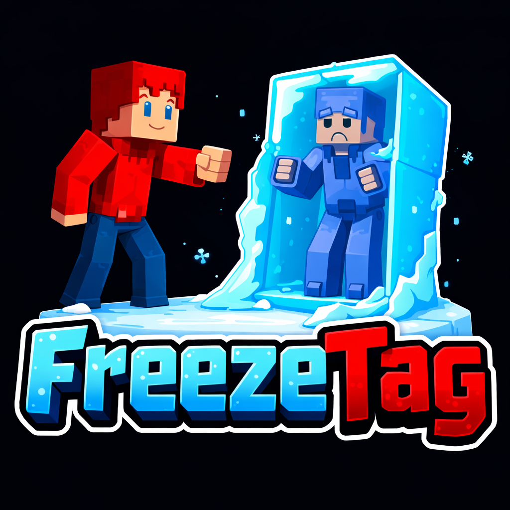
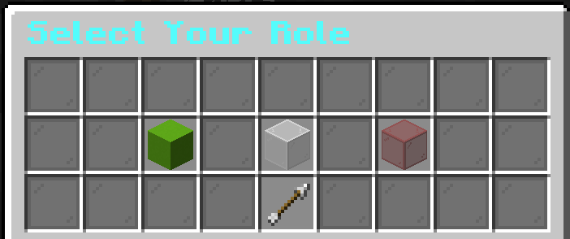
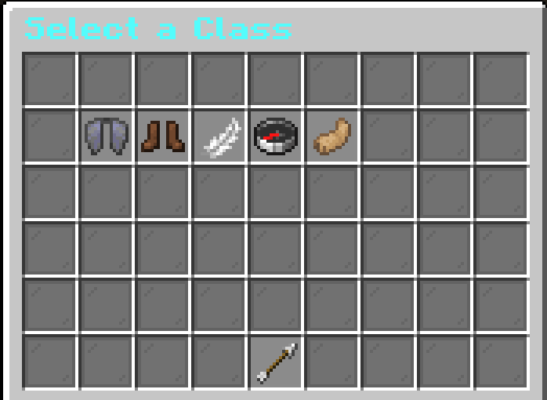
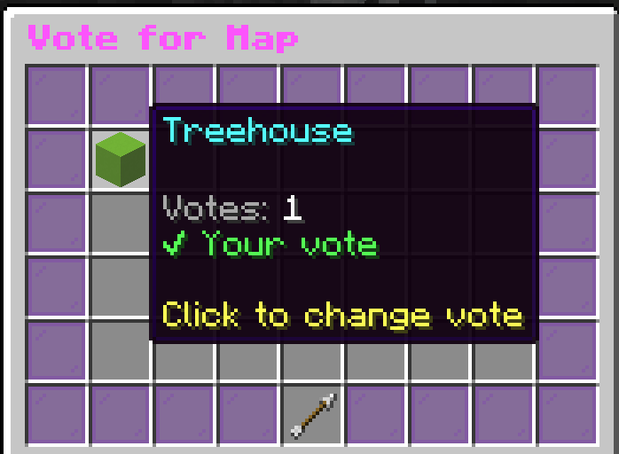

# FreezeTag




A fully customizable Freeze Tag minigame plugin for Paper 1.21.x (tested on 1.21.11).

## Demo Minecraft Server IP
FreezeTagXD.minekeep.gg

## Gameplay


Runners try to survive until the timer runs out. Taggers hunt them down and freeze them by hitting them (left-click). Frozen runners are completely stuck in place — they cannot move or jump — until a teammate rescues them by hitting them. If all runners are frozen before time is up, the taggers win. If any runner survives until time runs out, the runners win.


## Requirements

- Paper 1.21.x (1.21.4+)
- Java 21
- (Optional) Vault + an economy plugin for money rewards
- (Optional) WorldEdit — enables `/fta arena setbounds` for one-command boundary setup
- (Optional) WorldGuard — set `pvp allow` on your arena region so hits register

## Installation

1. Drop the jar into your `plugins/` folder.
2. Start the server — default config and class files are created automatically.
3. Set up at least one arena (see [Arena Setup](#arena-setup)).

---

## Arena Setup

All arena setup is done with `/fta arena <subcommand>`. Requires `freezetag.admin` (op by default).

### Quick Start

```
/fta arena create <name>          Create a new arena
/fta arena setlobby <name>        Set the lobby/waiting spawn to your current location
/fta arena addrunner <name>       Add a runner spawn at your current location (repeat for multiple)
/fta arena addtagger <name>       Add a tagger spawn at your current location (repeat for multiple)
/fta arena setbounds <name>       Set boundary from WorldEdit selection (recommended)
/fta arena enable <name>          Enable the arena (starts accepting players)
```

### Setting Arena Boundaries

**With WorldEdit (recommended):**
1. Make a selection with the WorldEdit wand (`//wand`) — select two opposite corners of your arena.
2. Run `/fta arena setbounds <name>` — both corners are applied in one command.

**Without WorldEdit:**
1. Stand at one corner and run `/fta arena setboundsmin <name>`.
2. Stand at the opposite corner and run `/fta arena setboundsmax <name>`.

### All Arena Subcommands

| Command | Description |
|---|---|
| `arena create <name>` | Create a new arena |
| `arena delete <name>` | Delete an arena |
| `arena setlobby <name>` | Set the lobby/waiting spawn |
| `arena addrunner <name>` | Add a runner spawn point |
| `arena addtagger <name>` | Add a tagger spawn point |
| `arena setbounds <name>` | Set both boundary corners from WorldEdit selection |
| `arena setboundsmin <name>` | Set boundary minimum corner manually |
| `arena setboundsmax <name>` | Set boundary maximum corner manually |
| `arena enable <name>` | Enable the arena |
| `arena disable <name>` | Disable the arena |
| `arena list` | List all arenas |
| `arena info <name>` | Show arena details |

---

## Player Commands

All player commands use `/freezetag` or the alias `/ft`.

| Command | Description |
|---|---|
| `/ft join [arena]` | Join a game (or the first available arena) |
| `/ft leave` | Leave the current game or queue |
| `/ft role <runner/tagger/none>` | Set your role preference |
| `/ft class <id>` | Select a class (must be in lobby) |
| `/ft status` | Show your current game status |
| `/ft list` | List active games |
| `/ft help` | Show help |

---

## GUI Screenshots

| Role Selection | Class Selection |
|:---:|:---:|
|  |  |

| Class Description | Map Vote |
|:---:|:---:|
|  |  |

---

## Lobby GUI

When you join a queue, four items appear in your hotbar. Right-click them:

| Slot | Item | Action |
|---|---|---|
| 0 | Book (your class icon) | Open class selection menu |
| 2 | Colored glass pane | Open role preference menu |
| 4 | Map | Open arena info panel |
| 8 | Barrier | Leave the queue |

- Lobby items **cannot be moved or dropped** — they are locked in place.
- The sidebar scoreboard shows your selected class and role preference at all times during the lobby.
- Role: shows `Waiting...` until the game actually starts and roles are assigned.

---

## Admin Commands

All admin commands use `/fta`. Requires `freezetag.admin` (op by default).

| Command | Description |
|---|---|
| `/fta start <arena>` | Force-start a game |
| `/fta stop <arena>` | Force-stop a game |
| `/fta reload` | Reload config and messages |
| `/fta forcefreeze <player>` | Freeze a player |
| `/fta forceunfreeze <player>` | Unfreeze a player |
| `/fta arena ...` | Arena management (see above) |
| `/fta vl setspawn` | Set the vote lobby spawn at your location |
| `/fta vl join` | Join the vote lobby |
| `/fta vl leave` | Leave the vote lobby |
| `/fta vl info` | Show vote lobby status |

---

## Classes

Classes are defined in `plugins/FreezeTag/classes/`. Each class provides passive stats and **two abilities** — one activated when you are a runner, and a different one when you are a tagger. The game gives you the right ability automatically when roles are assigned. You pick your class in the lobby before roles are decided.

### Default Classes

| Class | Passive Stats | Runner Ability | Tagger Ability |
|---|---|---|---|
| **Default** | None | — | — |
| **Sprinter** | Speed I | Sprint Burst — Speed III for 5s | Hunter's Snare — Slowness III to runners within 5 blocks |
| **Jumper** | Jump Boost I | High Jump — Jump V for 4s | Freeze Wave — Freeze all runners within 5 blocks |
| **Acrobat** | Speed, Slow Falling | Dash — Launch forward | Shadow Cloak — Invisibility for 4s |
| **Tactician** | Slightly slower | Group Rescue — Unfreeze all frozen runners within 6 blocks | Slow Field — Slowness II to runners within 8 blocks |

### Creating a Custom Class

Create a YAML file in `plugins/FreezeTag/classes/`. Example:

```yaml
name: "Ninja"
display-name: "&8Ninja"
description:
  - "&7A stealthy, fast class."
display-item: GOLDEN_SWORD
speed-modifier: 0.04
jump-modifier: 0.0
potion-effects:
  - type: NIGHT_VISION
    amplifier: 0
    duration: -1       # -1 = lasts the whole game
max-count: 0           # 0 = unlimited per game

ability-runner:
  enabled: true
  name: "Smoke Bomb"
  description: "&7Turn invisible for 3 seconds."
  type: INVISIBILITY
  cooldown: 20
  duration: 3
  amplifier: 0
  item: GUNPOWDER

ability-tagger:
  enabled: true
  name: "Shadow Strike"
  description: "&7Slow runners within 4 blocks."
  type: SLOW_AOE
  cooldown: 15
  duration: 3
  amplifier: 1         # slowness level
  radius: 4.0          # AoE radius in blocks
  item: BLAZE_ROD
```

### Ability Fields

| Field | Description |
|---|---|
| `type` | Ability type (see table below) |
| `cooldown` | Seconds before the ability can be used again |
| `duration` | How long the effect lasts in seconds (`0` = instant) |
| `amplifier` | Effect strength (e.g. `2` = level III potion) |
| `radius` | AoE radius in blocks — only used by `FREEZE_AOE`, `SLOW_AOE`, `UNFREEZE_AOE` (default `5.0`) |
| `item` | The hotbar item that activates the ability (right-click) |

### Ability Types

| Type | Effect |
|---|---|
| `SPEED_BOOST` | Give the player Speed for `duration` seconds |
| `JUMP_BOOST` | Give the player Jump Boost for `duration` seconds |
| `INVISIBILITY` | Make the player invisible (removes armor temporarily) |
| `DASH` | Launch the player forward |
| `FREEZE_AOE` | Freeze all runners within `radius` blocks |
| `SLOW_AOE` | Apply Slowness to all runners within `radius` blocks |
| `UNFREEZE_AOE` | Unfreeze all frozen runners within `radius` blocks |
| `DECOY` | Spawn an armor stand lookalike at your position |
| `SHIELD` | Give the player Resistance V for `duration` seconds |

---

## Smart Lobby

The lobby countdown adjusts automatically:

- **Waiting** — scoreboard shows player count; no countdown starts yet
- **Countdown starts** when `game.min-players` is reached
- **Pauses** if players drop below minimum mid-countdown (`lobby.pause-on-underpopulation`)
- **Speeds up** to `lobby.speed-up-countdown` when the arena is `lobby.speed-up-threshold`% full
- **Short countdown** (`lobby.full-countdown`) or instant start (`lobby.full-instant`) when completely full

Players who join mid-countdown immediately receive the hotbar GUI and scoreboard — no waiting for the next cycle.

---

## Vote Lobby

The vote lobby is a universal pre-game lobby where players vote on which arena to play — no arena is pre-selected.

### Setup

```
/fta vl setspawn     Set the vote lobby spawn at your current location
/fta vl join         Join the vote lobby
/fta vl leave        Leave the vote lobby
/fta vl info         Show vote lobby status
```

Players in the vote lobby get the same hotbar GUI as the normal lobby except slot 4 is a **rainbow cycling glass block** — right-click it to open the map vote menu and choose an arena. When the countdown expires the arena with the most votes is chosen and the game starts immediately.

The sidebar scoreboard shows countdown/waiting status, player count, your role preference, your selected class, and the currently leading arena vote — updated every second.

---

## Configuration

`plugins/FreezeTag/config.yml` — all values are documented inline. Key settings:

```yaml
game:
  tagger-percentage: 25      # % of players that become taggers
  min-players: 4             # minimum to start
  max-players: 20
  duration: 180              # game length in seconds
  freeze-duration: 0         # 0 = must be rescued; >0 = auto-thaw after N seconds
  rescue-enabled: true
  rescue-hits: 1             # hits needed to rescue a frozen runner
  rescue-cooldown: 5         # seconds between rescue attempts

lobby:
  countdown: 30
  speed-up-threshold: 80     # % full to trigger speed-up
  speed-up-countdown: 15
  full-countdown: 10
  full-instant: false

vote-lobby:
  min-players: 2
  countdown: 60

protection:
  disable-block-break: true
  disable-block-place: true
  arena-boundary: true
  boundary-action: TELEPORT_BACK   # TELEPORT_BACK | FREEZE | NOTHING
```

---

## Permissions

| Permission | Default | Description |
|---|---|---|
| `freezetag.play` | everyone | Use player commands, join games |
| `freezetag.admin` | op | Use admin commands, manage arenas |
| `freezetag.bypass` | op | Bypass game restrictions (commands, boundary, etc.) |

---

## WorldEdit

If WorldEdit is installed, `/fta arena setbounds <name>` reads your active selection and sets both boundary corners in one step. Without WorldEdit, use `setboundsmin` and `setboundsmax` separately.

## WorldGuard

If WorldGuard is installed, set `pvp allow` on your arena region — otherwise hits won't register and players can't be tagged or rescued.

---

## Building from Source

```
mvn clean package
```

Requires Java 21. The shaded jar is output to `target/`.
